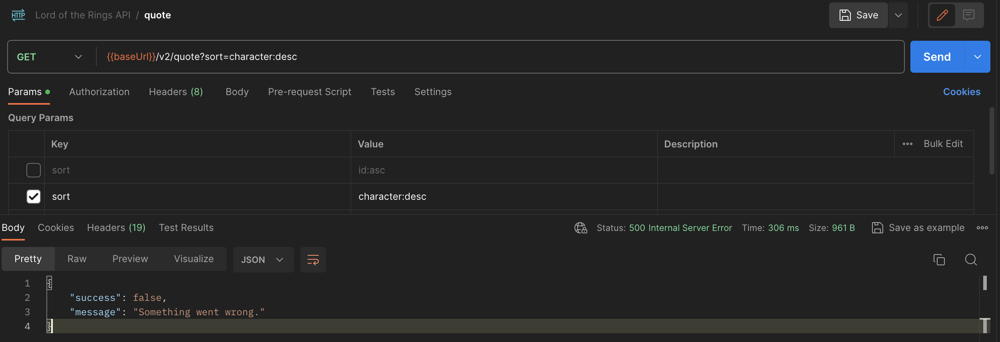
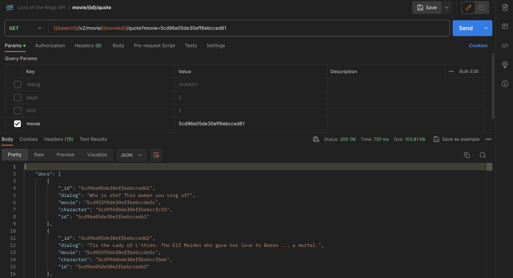

# the-one-api-sdk

TypeScript SDK for [The One API](https://the-one-api.dev) — covering movies and quotes from the Lord of the Rings and Hobbit trilogies. Note that quotes only work for the Lord of the Rings movies.

## Requirements

- Node.js 20+

## Installation

```bash
npm install the-one-api-sdk
```

## Authentication

All requests require a Bearer token. Register at [the-one-api.dev](https://the-one-api.dev) to obtain one.

## A note on sorting and filtering

The API docs say that sorting should work and gives this request as an example:`/quote?sort=character:desc`. However, this does not work when I try it (although it's fine without the `sort` parameter).




The API docs also say that filtering should work on any key.
> The filtering works by casting simple url parameter expressions to mongodb lookup expressions and can be applied to any available key on the data models.

It looks to work fine for listing all movies and quotes, but not `/movie/{{movieId}}/quote`. The SDK will only use that endpoint if no additional filters are given. If there are other filters, we will hit `/quote` instead with the movie id used to filter down to just quotes from that movie.



## Quick start

```ts
import { TheOneApiClient } from 'the-one-api-sdk';

const client = new TheOneApiClient({ apiKey: 'your-token' });

// Fetch a single movie
const movie = await client.movies.get('5cd95395de30eff6ebccde5c');
console.log(movie.name); // "The Fellowship of the Ring"

// List all movies
const { items } = await client.movies.list();
items.forEach(m => console.log(m.name));

// List quotes for a movie
const quotes = await client.movies.listQuotes('5cd95395de30eff6ebccde5c');
console.log(quotes.items[0].dialog);

// Fetch a single quote
const quote = await client.quotes.get('5cd96e05de30eff6ebcce7e9');
console.log(quote.dialog); // "Deagol!"

// List all quotes
const { items: allQuotes } = await client.quotes.list();
```

## API reference

### `client.movies.get(id)`

Fetch a single movie by ID. Throws `NotFoundError` if the ID does not exist.

```ts
const movie = await client.movies.get('5cd95395de30eff6ebccde5c');
// {
//   id: '5cd95395de30eff6ebccde5c',
//   name: 'The Fellowship of the Ring',
//   runtimeInMinutes: 178,
//   budgetInMillions: 93,
//   boxOfficeRevenueInMillions: 871.5,
//   academyAwardNominations: 13,
//   academyAwardWins: 4,
//   rottenTomatoesScore: 91
// }
```

### `client.movies.list(params?)`

List movies with optional filtering and pagination.

```ts
const result = await client.movies.list({
  limit: 5,
  runtimeInMinutes: { lt: 150 },
  academyAwardWins: { gt: 0 },
});
```

Available params:

| Param | Type |
|---|---|
| `limit` | `number` |
| `page` | `number` |
| `offset` | `number` |
| `name` | `StringFilter` |
| `runtimeInMinutes` | `NumberFilter` |
| `budgetInMillions` | `NumberFilter` |
| `boxOfficeRevenueInMillions` | `NumberFilter` |
| `academyAwardNominations` | `NumberFilter` |
| `academyAwardWins` | `NumberFilter` |
| `rottenTomatoesScore` | `NumberFilter` |

### `client.movies.listQuotes(movieId, params?)`

List all quotes for a specific movie.

```ts
const quotes = await client.movies.listQuotes('5cd95395de30eff6ebccde5c', {
  dialog: { regex: '/fool/i' },
});
```

Available params: `limit`, `page`, `offset`, `character` (`StringFilter`), `dialog` (`StringFilter`).

### `client.quotes.get(id)`

Fetch a single quote by ID. Throws `NotFoundError` if the ID does not exist.

```ts
const quote = await client.quotes.get('5cd96e05de30eff6ebcce7e9');
// { _id: '...', id: '...', dialog: 'Deagol!', movie: '...', character: '...' }
```

### `client.quotes.list(params?)`

List quotes with optional filtering and pagination.

```ts
const result = await client.quotes.list({
  movie: '5cd95395de30eff6ebccde5c',
  dialog: { regex: '/precious/i' },
});
```

Available params: `limit`, `page`, `offset`, `movie` (`StringFilter`), `character` (`StringFilter`), `dialog` (`StringFilter`).

## Filtering

All string and numeric fields accept rich filter expressions via `StringFilter` and `NumberFilter` types.

### NumberFilter

```ts
// Equality
{ runtimeInMinutes: 178 }

// Less than
{ budgetInMillions: { lt: 100 } }

// Greater than
{ academyAwardWins: { gt: 0 } }

// Greater than or equal
{ runtimeInMinutes: { gte: 160 } }

// Not equal
{ rottenTomatoesScore: { neq: 0 } }

// Field exists / does not exist
{ budgetInMillions: { exists: true } }
{ budgetInMillions: { exists: false } }
```

### StringFilter

```ts
// Equality
{ name: 'The Two Towers' }

// Include list (matches any of the values)
{ name: ['The Two Towers', 'The Return of the King'] }

// Not equal
{ name: { neq: 'The Hobbit Series' } }

// Not in list
{ name: { neq: ['The Hobbit Series', 'The Unexpected Journey'] } }

// Regex match
{ dialog: { regex: '/precious/i' } }

// Regex negation
{ dialog: { neq: { regex: '/fool/i' } } }

// Field exists / does not exist
{ dialog: { exists: true } }
{ dialog: { exists: false } }
```

## Pagination

List methods return a `PaginatedResponse<T>`:

```ts
interface PaginatedResponse<T> {
  items: T[];       // the records on this page
  total: number;    // total records across all pages
  limit: number;
  offset: number;
  page: number;
  pages: number;
  next: (() => Promise<PaginatedResponse<T>>) | null;
}
```

`next` is `null` on the last page. Otherwise, calling it fetches the next page preserving all original filter params:

```ts
let page = await client.movies.list({ limit: 2 });

while (page.next) {
  console.log(page.items.map(m => m.name));
  page = await page.next();
}
console.log(page.items.map(m => m.name)); // last page
```

## Error handling

All errors extend `TheOneApiError`, which carries a `status` code. Specific subclasses are thrown for known status codes:

| Class | Status |
|---|---|
| `AuthenticationError` | 401 |
| `InvalidRequestError` | 400 |
| `NotFoundError` | 404 |
| `RateLimitError` | 429 |
| `TheOneApiError` | everything else |

`RateLimitError` additionally exposes a `retryAfterMs` field (in milliseconds) when the server provides a `Retry-After` header.

```ts
import {
  TheOneApiClient,
  NotFoundError,
  RateLimitError,
  TheOneApiError,
} from 'the-one-api-sdk';

try {
  const movie = await client.movies.get(id);
} catch (e) {
  if (e instanceof NotFoundError) {
    console.log('Movie not found');
  } else if (e instanceof RateLimitError) {
    console.log(`Rate limited. Retry after ${e.retryAfterMs}ms`);
  } else if (e instanceof TheOneApiError) {
    console.log(`API error ${e.status}: ${e.message}`);
  } else {
    throw e;
  }
}
```

## Configuration

```ts
const client = new TheOneApiClient({
  apiKey: 'your-token',       // required
  baseUrl: 'https://...',     // optional, defaults to https://the-one-api.dev/v2
  timeout: 10_000,            // optional, ms, defaults to 30000
  fetch: customFetch,         // optional, custom fetch implementation (see below)
  retry: {                    // optional, all fields have defaults
    maxRetries: 2,
    statusCodes: [429, 503],
    initialDelayMs: 500,
    maxDelayMs: 30_000,
  },
});
```

### Custom fetch

By default the SDK uses `globalThis.fetch` (available natively in Node 20+). You can inject your own implementation — useful for testing, adding observability, or environments without native fetch:

```ts
import { TheOneApiClient } from 'the-one-api-sdk';
import nodeFetch from 'node-fetch';

const client = new TheOneApiClient({
  apiKey: 'your-token',
  fetch: nodeFetch as typeof fetch,
});
```

### Retry behaviour

Failed requests are automatically retried with exponential backoff and jitter. The delay for each attempt is:

```
min(initialDelayMs × 2^attempt + jitter, maxDelayMs)
```

If the server responds with a `Retry-After` header (common on 429 responses), that value takes precedence over the calculated backoff.

## Testing

### Unit tests

Unit tests use [Vitest](https://vitest.dev) and run fully offline — no API key required.

```bash
# Run all unit tests once
npm test

# Run in watch mode (re-runs on file changes)
npm run test:watch
```

The test suite covers:

- `errors.ts` — error class hierarchy, status codes, `retryAfterMs`
- `utils.ts` — every filter operator branch, `buildPaginatedResponse` mapping and `next()` behaviour
- `http.ts` — auth header, URL serialization, error mapping (400/401/404/429/500), `Retry-After` parsing, retry-on-503 and retry-on-429, no-retry for non-retryable codes
- `resources/movies.ts` — `get()`, `list()`, `listQuotes()` path construction, param passthrough, `NotFoundError` on empty response
- `resources/quotes.ts` — `get()`, `list()` path construction, param passthrough, `NotFoundError` on empty response

### Integration tests (against the live API)

These scripts make real requests to The One API and verify that filtering, pagination, and error handling all work end-to-end. You need a valid API key.

```bash
# Test movie endpoints
npm run test:prod:movies -- your-token

# Test quote endpoints
npm run test:prod:quotes -- your-token
```

Both scripts exit with a non-zero code on failure, making them suitable for CI.

### Running in CI

Store your API key as a repository secret named `THE_ONE_API_KEY` in GitHub. The included workflow (`.github/workflows/test.yml`) runs both integration scripts automatically on every push to `main`.

To add the secret: **Settings → Secrets and variables → Actions → New repository secret**.

## Local development

### Testing the SDK locally with npm link

`npm link` creates a symlink so a local test project always sees the latest build without reinstalling.

**Step 1 — build and register the SDK:**

```bash
cd the-one-api-sdk
npm run build
npm link
```

**Step 2 — link it in your test project:**

```bash
cd your-test-project
npm link the-one-api-sdk
```

**Step 3 — use it as normal:**

```ts
import { TheOneApiClient } from 'the-one-api-sdk';
```

**Step 4 — after making changes to the SDK, rebuild:**

```bash
cd the-one-api-sdk
npm run build
```

The symlink means your test project picks up the new build immediately — no reinstall needed.

**To unlink:**

```bash
# In your test project
npm unlink the-one-api-sdk

# In the SDK directory
npm unlink
```

## Publishing to npm

```bash
npm login         # one-time setup
npm run build     # or let prepublishOnly handle it
npm publish
```

For a scoped package (e.g. `@yourname/the-one-api-sdk`), update `"name"` in `package.json` and run:

```bash
npm publish --access public
```
